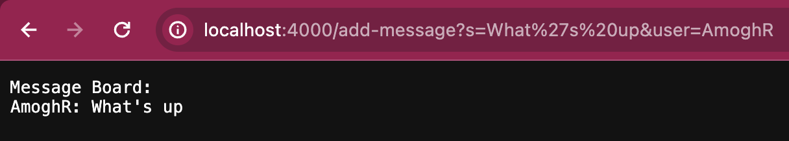
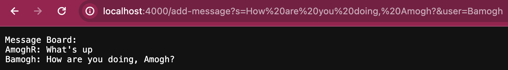
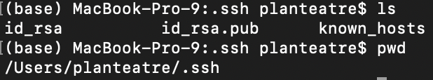
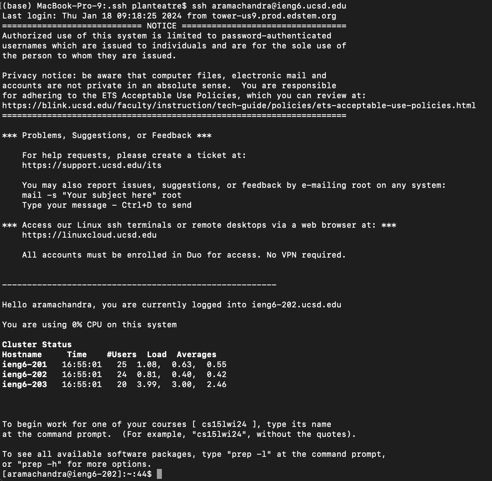

# Lab Report 2
This lab report is about servers and SSH keys.
## Part 1 - ChatServer

### Code
```java
import java.io.IOException;
import java.net.URI;
import java.util.Arrays;

class ChatServerHandler implements URLHandler {
    String savedText = "Message Board:\n";

    public String handleRequest(URI url) {
        if(url.getPath().equals("/")){
            return savedText;
        }
        else if(url.getPath().equals("/add-message")){
            String query = url.getQuery();
            if(query.startsWith("s=")){
                String[] remain = query.split("[=&]");
                if(remain.length != 4) {
                    System.out.println(Arrays.toString(remain));
                    return "404 Not Found!";
                }
                String message = remain[1];
                if(remain[2].equals("user")){
                    String user = remain[3];
                    savedText += String.format("%s: %s\n", user, message);
                    return savedText;
                }
                else {
                    return "Cannot find \"user\".";
                }
            }
            return "404 Not Found!";
        }
        return "404 Not Found!";
    }
}

class ChatServer {
    public static void main(String[] args) throws IOException {
        if(args.length == 0){
            System.out.println("Missing port number! Try any number between 1024 to 49151");
            return;
        }

        int port = Integer.parseInt(args[0]);

        Server.start(port, new ChatServerHandler());
    }
}
```

### Screenshot 1

The `handleRequest(URI url)` method is called with the argument of the url typed by the user. I also use the `getPath()` method of the `URI` class to return the string of the URL that was typed and see if it is appropriate to carry out a function. I use the `getQuery()` method of the `URI` class to return the string of the query. I store the query in an array of String values so each part of the query can be verified as a valid string to add a message to the board. If the path is appropriate to add a message to the message board, my code then adds the string of the message in a String field called `savedText`. `savedText` is then returned from the `handleRequest(URI url)` method and printed onto the screen. 

In this case, the message I typed after in the query was "What's up", which was translated into "What%27s%20up" in the url. The user was "AmoghR". Thus, the above was printed out.

### Screenshot 2

The same process outlined in screenshot 1 took place when using `/add-message` again. However, this time since I was adding another message to the message board, the field `savedText` was updated with the text that it was initialized with, the previous message, and then the message (and user) that was entered into the query. This time, the message was "How are you doing, Amogh?" by user "Bamogh". The message was translated into "How%20are you%20doing,%20Amogh?" in the url. 

## Part 2 - SSH

The absolute path to the private key is  `/Users/planteatre/.ssh/id_rsa`. The absolute path to the public key is  `/Users/planteatre/.ssh/id_rsa.pub`.



Below is an interaction where I log into ieng6 without being asked for the password.



## Part 3 - Something I Learned

I learned that making a server is a lot easier than I thought. I didn't know most of the functionality is abstracted and we don't have to do any very tehcnical work in setting up the network. These servers also centralize operations made by anyone who has access to the server on the web, so we can run multiple operations at the same time from different devices and the server keeps track of it.
