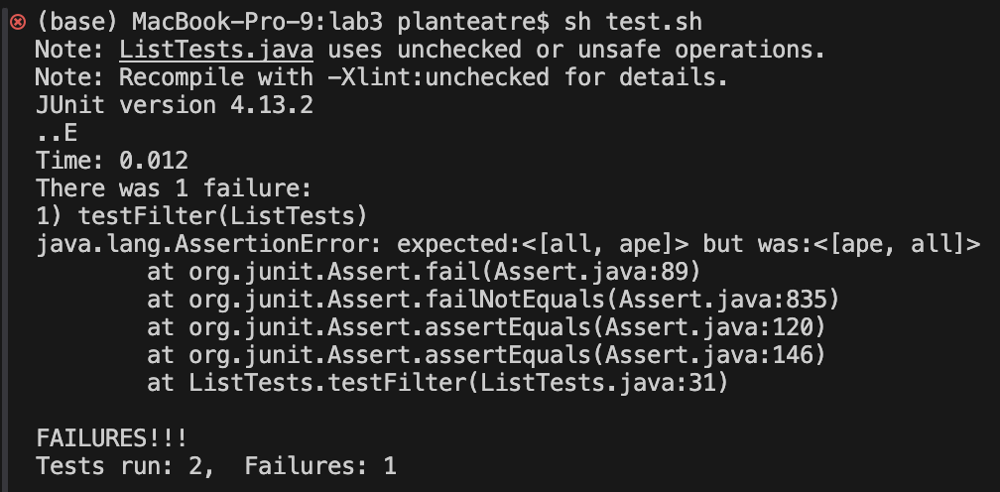
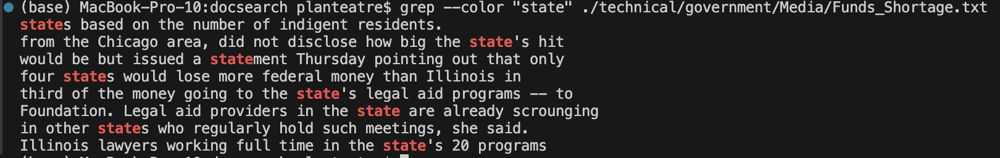
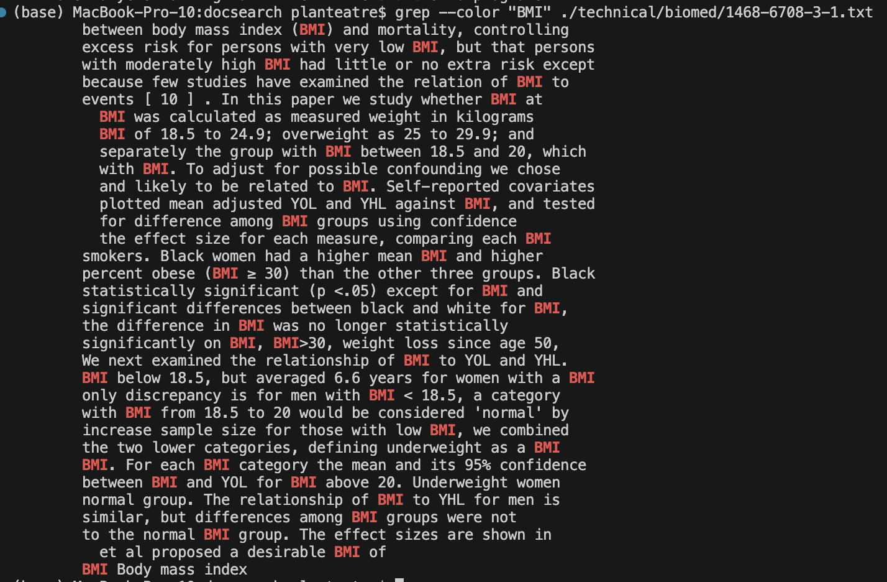

# Lab Report 3
This lab report is about debugging and new command-line commands.

## Part 1 - Bug in the filter method of ListExamples.java
The `filter(List<String> list, StringChecker sc)` method traverses a list and adds items that return true by my `StringChecker` object to a new list, which is returned by the method. The filter should maintain the order of the original list.

Below is my implementation of the `StringChecker` class, where the `checkString(String s)` method returns true if the String contains an a.
```java
class Checker implements StringChecker {
    public boolean checkString(String s){
            return s.contains("a");
    }
}
```

### Failure Inducing Input
My input was the list `[all, court, ape]` and the output was `[ape, all]`. The expected output was `[all, ape]`.
```java
@Test
public void testFilter(){
    ArrayList<String> input = new ArrayList<String>();
    input.add("all");
    input.add("court");
    input.add("ape");

    ArrayList<String> expected = new ArrayList<>();
    expected.add("all");
    expected.add("ape");

    ArrayList<String> filtered = (ArrayList) ListExamples.filter(input, new Checker());

    assertEquals(expected, filtered);
}
```

### Test that Passes
My input was the list `[bring, take, potion, trench]` and the output was `[take]`. The expected output was `[take]`.
```java
@Test
public void testFilter(){
    ArrayList<String> input = new ArrayList<String>();
    input.add("bring");
    input.add("take");
    input.add("potion");
    input.add("trench");

    ArrayList<String> expected = new ArrayList<>();
    expected.add("take");

    ArrayList<String> filtered = (ArrayList) ListExamples.filter(input, new Checker());

    assertEquals(expected, filtered);
}
```

### Symptom (Output of both JUnit Tests)


### Bug

Before:

```java
  static List<String> filter(List<String> list, StringChecker sc) {
    List<String> result = new ArrayList<>();
    for(String s: list) {
      if(sc.checkString(s)) {
        result.add(0, s); // here is the error
      }
    }
    return result;
  }
```

After:

```java
  static List<String> filter(List<String> list, StringChecker sc) {
    List<String> result = new ArrayList<>();
    for(String s: list) {
      if(sc.checkString(s)) {
        result.add(s); // the change from prepending to appending
      }
    }
    return result;
  }
```

This fix addresses the issue because before, items that passed the string check were prepended to the resulting list. This meant that the order of the original list wasn't preserved, and was in fact reversed. By changing the method call from `add(int index, E element)` to `add(E element)`, the element is added to the end of the list and the order of the list is preserved.

## Part 2 - Researching the Grep command

### -i case insensitive command
* example 1:
```console
(base) MacBook-Pro-10:docsearch planteatre$ grep -i -r "budget" ./technical/government/Env_Prot_Agen/
./technical/government/Env_Prot_Agen//section-by-section_summary.txt:allowances covering emissions. Subpart 3 codifies the budgets and
./technical/government/Env_Prot_Agen//section-by-section_summary.txt:Subpart 3. Ozone Season NOx Budget Program
./technical/government/Env_Prot_Agen//section-by-section_summary.txt:trading budgets; the criteria for classifying cogeneration units as
./technical/government/Env_Prot_Agen//section-by-section_summary.txt:administer the ozone season NOx budget trading program under the
./technical/government/Env_Prot_Agen//section-by-section_summary.txt:allowances under the NOx budget trading program administered by the
./technical/government/Env_Prot_Agen//final.txt:NOx Budget Trading Program beginning May 1, 2003.
./technical/government/Env_Prot_Agen//final.txt:Budget Program). The revised ozone NAAQS and new PM2.5 NAAQS could
./technical/government/Env_Prot_Agen//bill.txt:''Subpart 3-Ozone Season NOx Budget Program
./technical/government/Env_Prot_Agen//bill.txt:SUBPART 3. OZONE SEASON NOx BUDGET PROGRAM.
./technical/government/Env_Prot_Agen//bill.txt:requirements, including the State's nitrogen oxides budget and
```
* example 2:
```console
(base) MacBook-Pro-10:docsearch planteatre$ grep -i "assault" ./technical/911report/chapter-3.txt 
            4 RESPONSES TO AL QAEDA'S INITIAL ASSAULTS
                QAEDA'S INITIAL ASSAULTS 111 growing Islamic extremism in Pakistan, State Department
                ASSAULTS 115 it, from the vantage point of the driver looking through a muddy
                INITIAL ASSAULTS 117 that a soil sample from the vicinity of the al Shifa plant had
                QAEDA'S INITIAL ASSAULTS 119 Ladin. Was this just a new and especially venomous
                INITIAL ASSAULTS 121 able targets were not promising. The experience of the previous
                concerned that it would damage already RESPONSES TO AL QAEDA'S INITIAL ASSAULTS 123
                INITIAL ASSAULTS 125 Northern Alliance with Pashtun groups. One U.S. diplomat later
                QAEDA'S INITIAL ASSAULTS 127 Select Committee on Intelligence on September 2, Tenet
                    the IG had completed planning for RESPONSES TO AL QAEDA'S INITIAL ASSAULTS 129
                draft told us that what was envisioned was a group of tribals assaulting a location,
                finished the job long before," RESPONSES TO AL QAEDA'S INITIAL ASSAULTS 133 but they
                QAEDA'S INITIAL ASSAULTS 135 and do something that everyone would later regret.
                TO AL QAEDA'S INITIAL ASSAULTS 137 attempt to gather intelligence and wait for an
                diploRESPONSES TO AL QAEDA'S INITIAL ASSAULTS 139 mat that the UAE valued its
                ASSAULTS 141 hit. Second, the administration, and the CIA in particular, was in the
                if his own interests and those of the RESPONSES TO AL QAEDA'S INITIAL ASSAULTS 143
```
This command searches for the string in files regardless of whether the text in the actual files have certain cases. This is useful for when you're not sure if a string is capitalized or not in the file(s).

### -c get string pattern count
* example 1:
```console
(base) MacBook-Pro-10:docsearch planteatre$ grep -c -r "budget" ./technical/government/Env_Prot_Agen/
./technical/government/Env_Prot_Agen//multi102902.txt:0
./technical/government/Env_Prot_Agen//section-by-section_summary.txt:4
./technical/government/Env_Prot_Agen//jeffordslieberm.txt:0
./technical/government/Env_Prot_Agen//final.txt:0
./technical/government/Env_Prot_Agen//ctf7-10.txt:0
./technical/government/Env_Prot_Agen//ctf1-6.txt:0
./technical/government/Env_Prot_Agen//ro_clear_skies_book.txt:0
./technical/government/Env_Prot_Agen//ctm4-10.txt:0
./technical/government/Env_Prot_Agen//1-3_meth_901.txt:0
./technical/government/Env_Prot_Agen//atx1-6.txt:0
./technical/government/Env_Prot_Agen//tech_sectiong.txt:0
./technical/government/Env_Prot_Agen//bill.txt:1
./technical/government/Env_Prot_Agen//nov1.txt:0
./technical/government/Env_Prot_Agen//tech_adden.txt:0
```
* example 2:
```console
(base) MacBook-Pro-10:docsearch planteatre$ grep -c "ketosynthase" ./technical/plos//journal.pbio.0020035.txt
6
```
This command returns the amount of times the string shows up in the file(s). This can make it easier to decide which file is relevant (you can filter for files that use the string pattern many times).

### -w find exact string
* example 1:
```console
(base) MacBook-Pro-10:docsearch planteatre$ grep -w -r "money" ./technical/government/Media/
./technical/government/Media//Federal_agency.txt:that money out of South Carolina," he said. Kleiman said if the
./technical/government/Media//Legal-aid_chief.txt:have been pressed to raise more money.
./technical/government/Media//Legal-aid_chief.txt:The staff is driven by reasons other than money, he said, and
./technical/government/Media//Unusual_Woodburn.txt:hometown associations, that send money home for projects such as
# .... shortened for convenience
./technical/government/Media//NJ_Legal_Services.txt:with them for money to fund its own programs.
./technical/government/Media//NJ_Legal_Services.txt:possibility of directing some of the LSC money to Passaic as a
./technical/government/Media//Legal_Aid_campaign.txt:Segal said raising money to help Legal Aid is critical "to help
```
* example 2:
```console
(base) MacBook-Pro-10:docsearch planteatre$ grep -w -r "financial assistance" ./technical/government/
./technical/government//About_LSC/commission_report.txt:Corporation may be used to provide financial assistance to [a
./technical/government//About_LSC/Protocol_Regarding_Access.txt:conditions upon which financial assistance was provided." See
./technical/government//Gen_Account_Office/d0269g.txt:Medicare and Medicaid; financial assistance benefits, such as Food
./technical/government//Gen_Account_Office/d0269g.txt:medical research, financial assistance to low-income families, to
./technical/government//Gen_Account_Office/GovernmentAuditingStandards_yb2002ed.txt:financial assistance. OMB Circular A-133, "Audits of States, Local
./technical/government//Gen_Account_Office/GovernmentAuditingStandards_yb2002ed.txt:governmental financial assistance.
./technical/government//Gen_Account_Office/Sept14-2002_d011070.txt:to $100,000 in financial assistance to citizens adversely affected
./technical/government//Gen_Account_Office/Sept14-2002_d011070.txt:financial assistance, and to help to ensure that applicants are
./technical/government//Gen_Account_Office/og97041.txt:not identified any sources of federal financial assistance to
./technical/government//Media/Hard_to_Get.txt:Increased financial assistance from federal, state and local
./technical/government//Media/All_May_Have_Justice.txt:age. This campaign provides financial assistance to agencies that
./technical/government//Media/Weak_economy.txt:Advocates turning to state for financial assistance
```
This command is finding the exact instances of the string pattern. For instance, if you want to search for the word "member," you may not want "remember" to be valid.

### --color make string pattern visible
* example 1:
```console
(base) MacBook-Pro-10:docsearch planteatre$ grep --color "state" ./technical/government/Media/Funds_Shortage.txt
states based on the number of indigent residents.
from the Chicago area, did not disclose how big the state's hit
would be but issued a statement Thursday pointing out that only
four states would lose more federal money than Illinois in
third of the money going to the state's legal aid programs -- to
Foundation. Legal aid providers in the state are already scrounging
in other states who regularly hold such meetings, she said.
```

* example 2:
```console
(base) MacBook-Pro-10:docsearch planteatre$ grep --color "BMI" ./technical/biomed/1468-6708-3-1.txt
        between body mass index (BMI) and mortality, controlling
        excess risk for persons with very low BMI, but that persons
        with moderately high BMI had little or no extra risk except
        because few studies have examined the relation of BMI to
        events [ 10 ] . In this paper we study whether BMI at
          BMI was calculated as measured weight in kilograms
          BMI of 18.5 to 24.9; overweight as 25 to 29.9; and
          separately the group with BMI between 18.5 and 20, which
          with BMI. To adjust for possible confounding we chose
          and likely to be related to BMI. Self-reported covariates
          plotted mean adjusted YOL and YHL against BMI, and tested
          for difference among BMI groups using confidence
          the effect size for each measure, comparing each BMI
        smokers. Black women had a higher mean BMI and higher
        percent obese (BMI ≥ 30) than the other three groups. Black
        statistically significant (p <.05) except for BMI and
        significant differences between black and white for BMI,
        the difference in BMI was no longer statistically
        significantly on BMI, BMI>30, weight loss since age 50,
        We next examined the relationship of BMI to YOL and YHL.
        BMI below 18.5, but averaged 6.6 years for women with a BMI
        only discrepancy is for men with BMI < 18.5, a category
        with BMI from 18.5 to 20 would be considered 'normal' by
        increase sample size for those with low BMI, we combined
        the two lower categories, defining underweight as a BMI
        BMI. For each BMI category the mean and its 95% confidence
        between BMI and YOL for BMI above 20. Underweight women
        normal group. The relationship of BMI to YHL for men is
        similar, but differences among BMI groups were not
        to the normal BMI group. The effect sizes are shown in
          et al proposed a desirable BMI of
        BMI Body mass index
```

This command colors the string pattern that is being searched for. This makes it a lot easier for users to see how the string pattern is being used in the context of the rest of file. I included the screenshots to show the respective strings were actually highlighted.

I used this [DigitalOcean](https://www.digitalocean.com/community/tutorials/grep-command-in-linux-unix) website as a source for all four of these commands.
