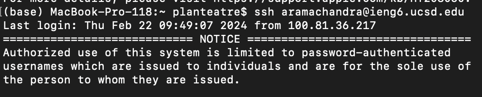
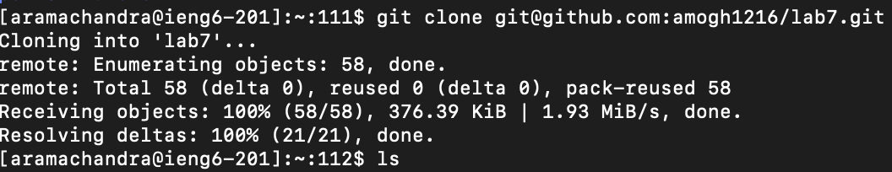
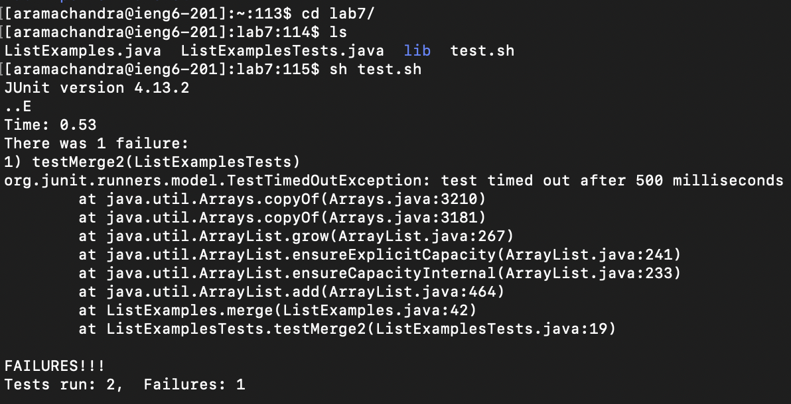
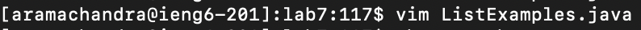
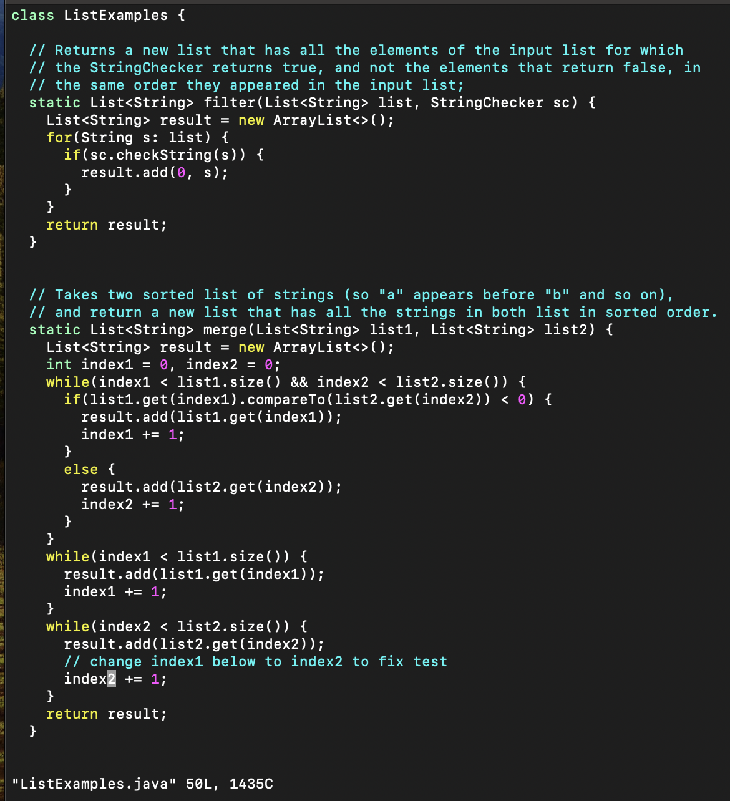
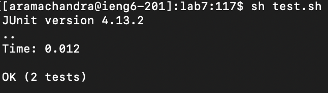
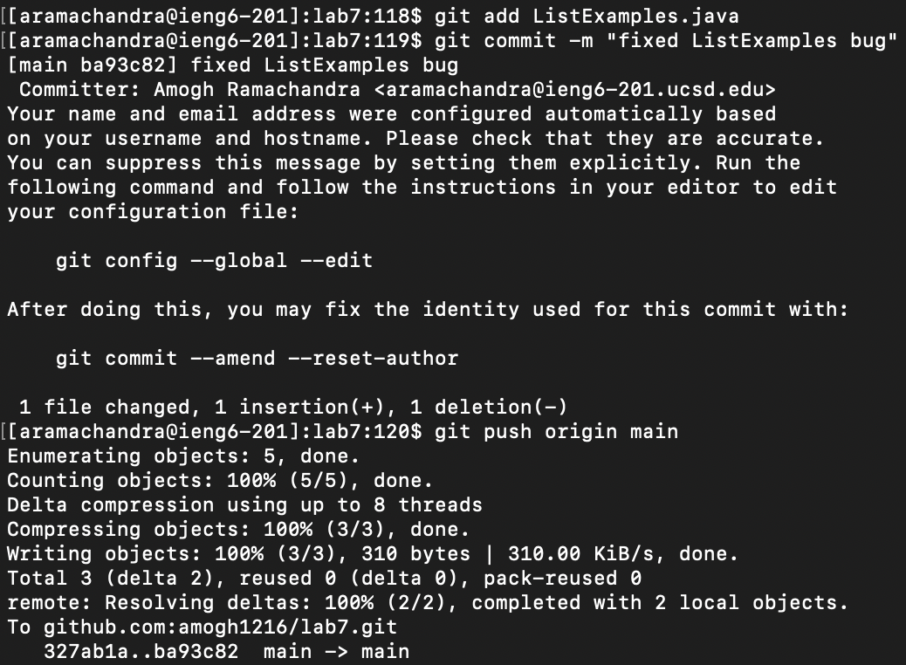

# Lab Report 4
by Amogh Ramachandra

This lab report records the keystrokes I used to clone, run tests, edit files, rerun tests, and commit+push my changes onto a repository.

## My Keystrokes

### 4. Logging into ieng6
Logging into ieng6 was already in my bash history, I pressed `<up><up><enter>` to get to the command `ssh aramachandra@ieng6.ucsd.edu`. I was able to login.

### 5. Cloning repository
Keys pressed: `git clone Ctrl-V<enter>` to clone the repository from an SSH github key that I had copied.

### 6. Running Tests
Keys pressed: `cd la<Tab><enter>` to change directories into `lab7/`. `ls<enter>` to view the files/directories contained. `sh t<tab><enter` to run the test.sh file. I can see the failure in the test. The error comes from the file `ListExamples.java` on line 42.

### 7. Editing File To Fix Tests
Keys pressed: `vim L<tab>.<tab><enter>` to run vim on the file `ListExamples.java`. `:$-6<enter>` to get to the 6th line from the bottom. `index1` needed to be changed to `index2`. So I pressed `e` to get to the end of line and `x` to delete the last character. I then pressed `i` to go into insert mode and press `2` to complete the variable name. Then `<esc>:wq` to exit the file.

### 8. Rerun tests
Keys pressed: `<up><up><enter>` to get to the command which I used to test the file and run it. The tests are successfully run without failure.

### 9. Commit and pushing changes to Github
Keys pressed: `git add L<tab><enter>` to prepare the changes made to `ListExamples.java` for committing. `git commit -m "fixed ListExamples bug"` to commit my file. `git push origin main` to push my commit to Github.

